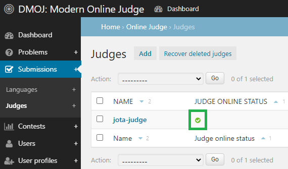

# Setting JOTA Judge

*Last Update: 10. Jul. 2021*

**DMOJ judge official docs**: https://docs.dmoj.ca/#/judge/setting_up_a_judge

## 시작하기 전 필독
* **JCloud와 JOTA Web 설정을 마친 후 진행할 수 있습니다. 아직 설치하지 않았다면 [여기서부터](https://github.com/hyunchan-park/JOTA-dmoj-online-judge) 시작하십시오.**
* 반드시 공식 문서를 읽으면서 진행하십시오. 명령어는 아래의 수정된 명령어를 참고하세요.
* 본인의 github 계정에서 해당 repository를 **fork** 하십시오: https://github.com/hyunchan-park/JOTA-dmoj-judge-server
* judge 서버를 열기 위한 새 SSH 연결 세션을 만듭니다. (세션 #3)
* 외부 IP로 Judge 서버를 테스트하지 않았습니다. 현재 localhost 로만 테스트하였습니다.
  
## Setting up a Judge
original: https://docs.dmoj.ca/#/judge/setting_up_a_judge?id=setting-up-a-judge

1. JOTA Web (e.g. http://localhost:8000/) 에 접속합니다.
2. admin 계정으로 로그인합니다. admin 계정을 임의로 만들지 않은 경우 아래의 정보로 접속 가능합니다. 상황에 따라 비밀번호를 변경해야 할 수도 있습니다.
    ```
    ID = admin
    PW = admin
    ```

## Site-side setup
original: https://docs.dmoj.ca/#/judge/setting_up_a_judge?id=site-side-setup

```
$ sudo supervisorctl status
```

## Judge-side setup
original: https://docs.dmoj.ca/#/judge/setting_up_a_judge?id=judge-side-setup

* fork 했던 저장소를 `judge` 폴더 안에 저장
    ```
    ~/jota$ git clone --recursive https://github.com/<your-github-id>/JOTA-dmoj-judge-server judge
    ~/jota$ cd judge
    ~/jota/judge$ sudo pip3 install -e .
    ```


### **Configuring the judge**
original: https://docs.dmoj.ca/#/judge/setting_up_a_judge?id=configuring-the-judge

* `judge.yml` 파일 만들기
  1. 양식 파일을 생성합니다.
      ```
      ~/jota/judge$ { printf "id: \nkey: \"\"\nproblem_storage_root:\n  - /home/ubuntu/jota/problems\n" ; dmoj-autoconf ; } > judge.yml
      ```

  2. vi로 파일을 수정합니다.
      ```
      ~/jota/judge$ vi judge.yml
      ```
  3. JOTA Web 오른쪽 상단 admin 페이지로 접속합니다.
  4. Submissions > Judges 선택합니다.
  5. `jota-judge` 를 누릅니다.
  6. Regenerate 버튼을 누른 후, 하단의 Save 버튼을 누릅니다.
  7. `jota-judge` 를 다시 누릅니다.
  8. `Name` 과 `Authentication key` 에 해당하는 값을 기입합니다.
      ```
      id: <judge name>
      key: "<judge authentication key>"
      problem_storage_root:
      - /home/ubuntu/jota/problems
      runtime:
      ...
      ```
  9. 수정된 `judge.yml` 파일을 저장합니다.

* Judge 서버를 열기 위한 새 SSH 연결 세션을 만듭니다. (세션 #3)

* judge를 사이트에 붙이기 전에 CLI judge 테스트
    ```
    ~/jota/judge$ dmoj-cli -c judge.yml
    ```

* judge 서버 열기 (localhost)
    ```
    ~$ dmoj -c jota/judge/judge.yml localhost
    ```
    
* judge 서버 열기 (IP/Port 특정)
    ```
    ~$ dmoj -c jota/judge/judge.yml -p "$PORT" "$IP"
    ```

✅ 연결된 judge 서버



❌ 연결되지 않은 judge 서버


